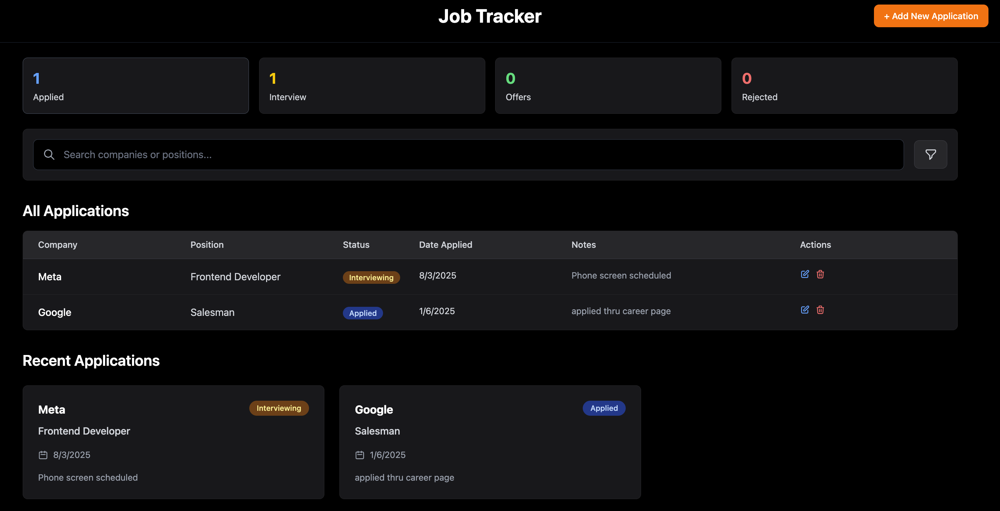

# Job Tracker

A full-stack job application tracking system built with React and Node.js.

## Screenshots

### Dashboard Overview

## Setup Instructions

• Install dependencies: `cd server && npm install` then `cd ../client && npm install`
• Create `server/.env` file with your Supabase credentials
• Start backend: `cd server && npm run dev`
• Start frontend: `cd client && npm run dev`  
• Open `http://localhost:5173`